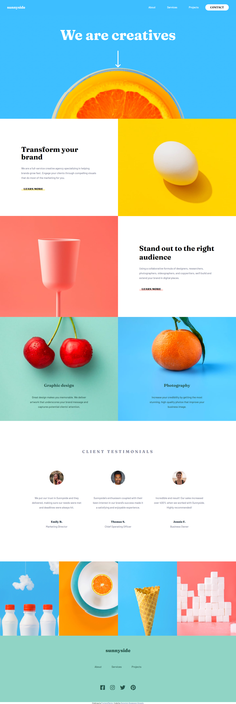

# Frontend Mentor - Sunnyside agency landing page solution

This is a solution to the [Sunnyside agency landing page challenge on Frontend Mentor](https://www.frontendmentor.io/challenges/sunnyside-agency-landing-page-7yVs3B6ef). Frontend Mentor challenges help you improve your coding skills by building realistic projects.

## Table of contents

- [Overview](#overview)
  - [The challenge](#the-challenge)
  - [Screenshot](#screenshot)
  - [Links](#links)
- [My process](#my-process)
  - [Built with](#built-with)
  - [What I learned](#what-i-learned)
  - [Continued development](#continued-development)
  - [Useful resources](#useful-resources)
- [Author](#author)
- [Acknowledgments](#acknowledgments)

## Overview
The Sunny side agency landing page is a project i worked on with html, pure css and vanilla javascript, vanilla javascript for the navigation bar mobile view toggle functionality.

### The challenge

Users should be able to:

- View the optimal layout for the site on a large screen and a 500px width responsive mobile view
- See hover states for all interactive elements on the page

### Screenshot

### Links

- Solution URL: [Solution page on FrontendMentor](https://www.frontendmentor.io/solutions/sunnyside-agency-landing-page-rB3gKq1GV)
- Live Site URL: [Live Site](https://oluwajuwonomoyele.github.io/sunnyside/)

## My process
I started out with the desktop-first workflow then went on to design the mobile workflow. It took me 3 days to complete this project and I learnt a few things on the cause of buliding this project. I commited to github per every section I made so as to have a clear understanding when reverting back to commits. I also contemplated on either using pure css or bootstrap, then i decided to use pure css after much delibration. I was really fun working on this project!

### Built with

- Semantic HTML5 markup
- CSS custom properties
- Flexbox
- CSS Grid
- Destop-first workflow

### Continued development

For future reference, i'll like to focus on the navigation bar styling mostly on mobile view and also javascript functionality of pages.

### Useful resources

- [w3schools](https://www.w3schools.com) - This helped me with sorting out some basic arrangements and alignments in css.
- [freeCodeCamp](https://www.freecodecamp.com) - This helped me to recall the idea on css animations.

## Author

- Frontend Mentor - [@Oluwajuwonomoyele](https://www.frontendmentor.io/profile/Oluwajuwonomoyele)
- Twitter - [@OlutomisinJuwon](https://twitter.com/OlutomisinJuwon)
